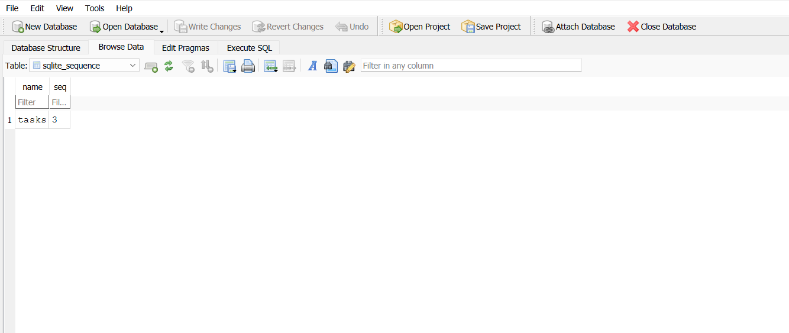
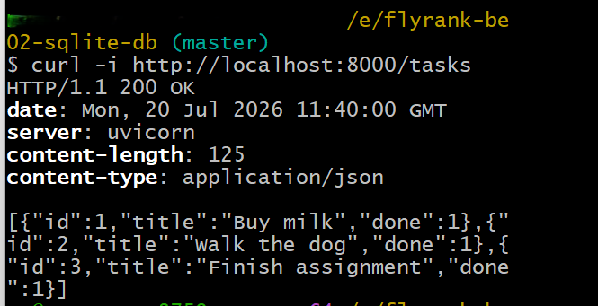
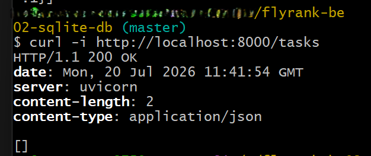

# FlyRank BE-02 — Connecting your CRUD to the database

Continuation of [flyrank-be01-crud-api](https://github.com/<your-username>/flyrank-be01-crud-api).
Same API, same endpoints — the in-memory task list has been replaced with a real SQLite database.

## Stack
- Python 3 + FastAPI
- SQLite via Python's built-in `sqlite3` module (raw SQL, parameterized queries)

## Why SQLite
SQLite needs no separate server or installation — the entire database is a single file
(`tasks.db`) on disk. That's ideal for a small project like this: zero setup, and data now
survives a server restart, which was the whole limitation in Assignment 1 (in-memory storage).

## Where the database lives
- File: `tasks.db`, created automatically in the project root the first time the app runs.
- It is **git-ignored** — every fresh clone starts with no database file, and the app creates
  it (and seeds 3 example tasks) automatically on first run.

## How to run
```bash
git clone https://github.com/<your-username>/flyrank-be02-sqlite-db.git
cd flyrank-be02-sqlite-db
python -m venv venv
source venv/Scripts/activate      # Windows Git Bash
pip install -r requirements.txt
uvicorn main:app --reload
```
Server runs at `http://localhost:8000`. Interactive docs at `http://localhost:8000/docs`.

## Endpoints

| Method | Path              | Description              | Success | Errors             |
|--------|-------------------|---------------------------|---------|---------------------|
| GET    | `/tasks`          | List all tasks             | 200     | —                   |
| GET    | `/tasks/{id}`     | Get one task                | 200     | 404 unknown id      |
| POST   | `/tasks`          | Create a task                | 201     | 400 empty title     |
| PUT    | `/tasks/{id}`     | Update a task                | 200     | 400 / 404           |
| DELETE | `/tasks/{id}`     | Delete a task                | 204     | 404 unknown id      |

## Persistence proof
Created tasks via `POST /tasks`, restarted the `uvicorn` server, then called `GET /tasks` —
tasks were still present. Data no longer disappears on restart.

## Stage 4 — exploring SQLite directly

Opened `tasks.db` in **DB Browser for SQLite** and ran queries by hand in the Execute SQL tab:

```sql
UPDATE tasks SET done = 1;
```

Result: 3 rows affected. After clicking "Write Changes," calling `GET /tasks` immediately
reflected the change with no server restart — proof that the API and DB Browser read the
exact same file, with no syncing involved:

```json
[{"id":1,"title":"Buy milk","done":1},
 {"id":2,"title":"Walk the dog","done":1},
 {"id":3,"title":"Finish assignment","done":1}]
```





## AI disclosure
Used Claude for guidance and code structure. Implemented, ran, and understood every stage myself, including the DB Browser exploration in Stage 4.